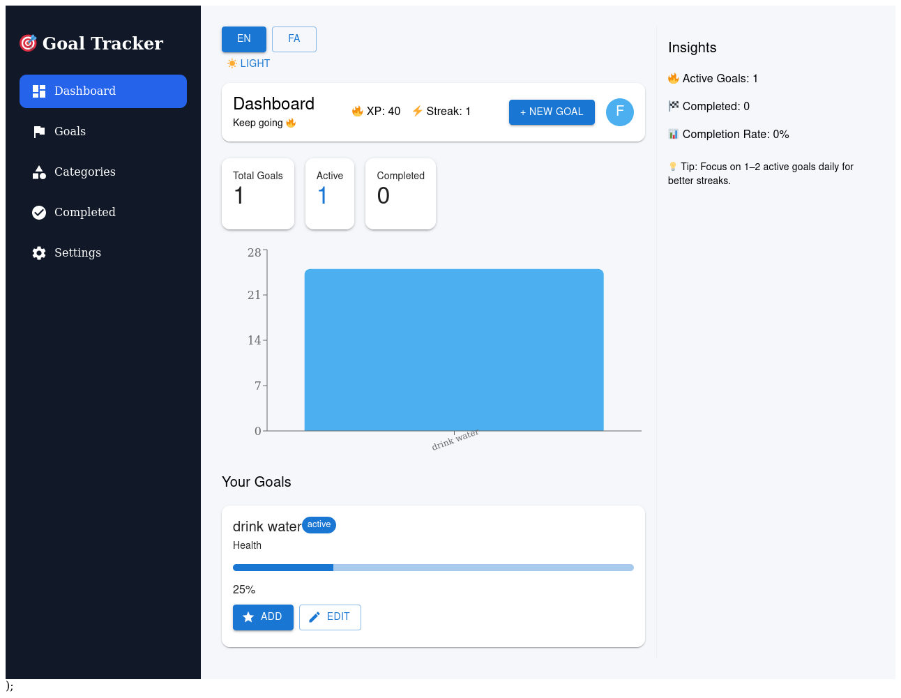
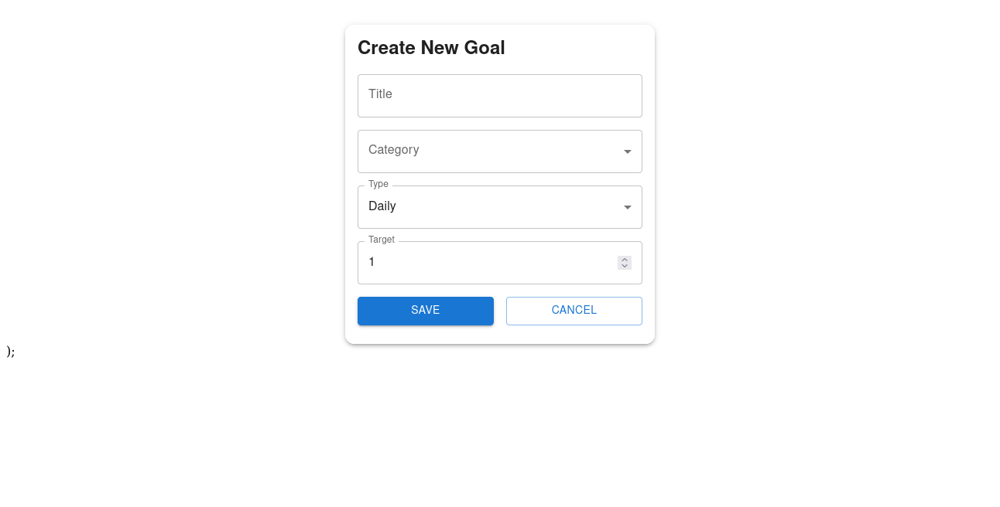
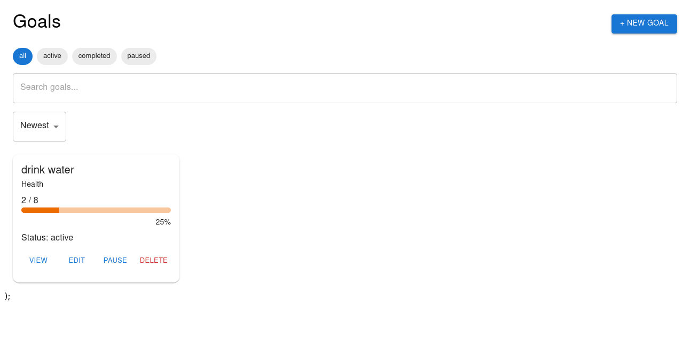
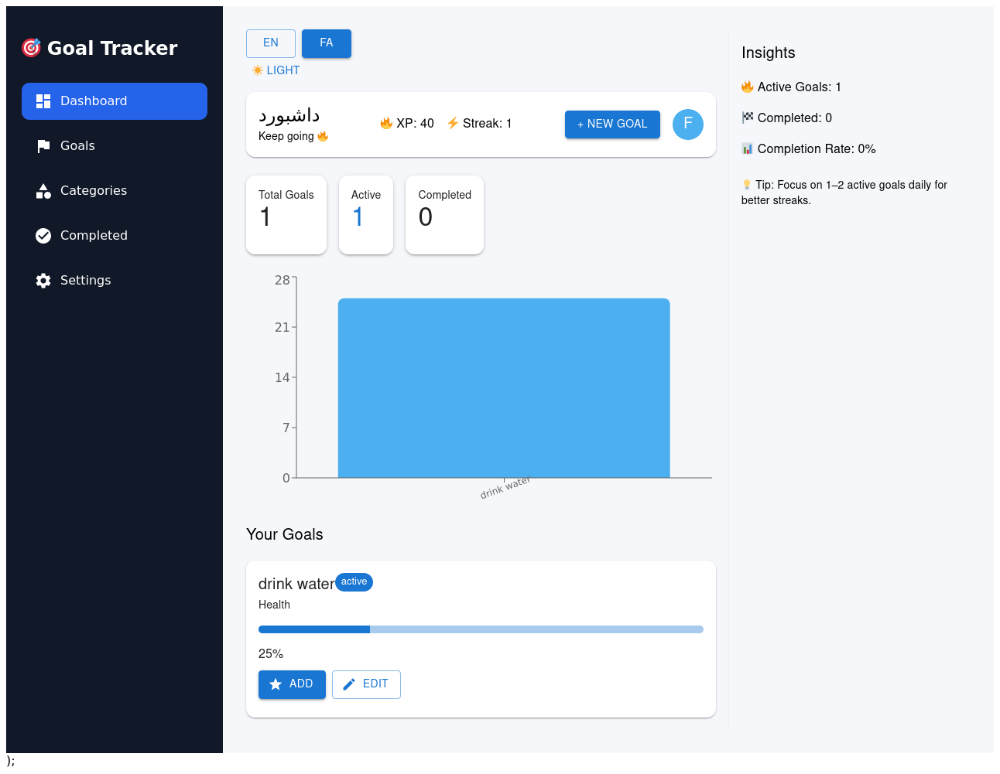

# 🎯 Goal Tracker Dashboard

A multi-page React web app for tracking goals, habits, and progress with XP, streaks, and multilingual support.

## 🚀 Features

- ✅ Create, edit, delete goals
- 📊 Dashboard with completion %, XP, streak
- 🔥 Streak tracking system
- ⭐ XP gamification system
- 🔍 Search, filter, sort goals
- 📦 Completed goals archive
- 🌍 Multi-language (English + Persian)
- 🔄 RTL/LTR layout switching
- 📱 Responsive design

## 🛠️ Tech Stack

- React + Vite
- React Router
- LocalStorage
- Context API

## 📸 screenshoot


## ▶️ Run Locally

```bash
npm install
npm run dev
```






